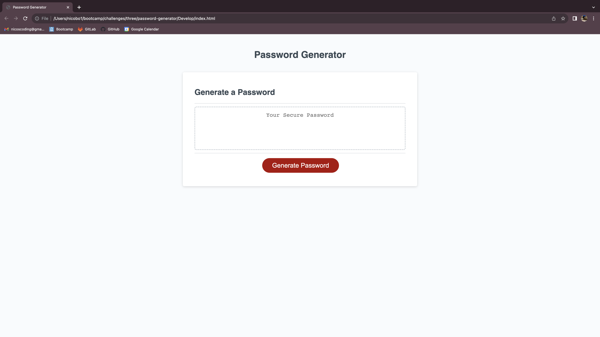

# Password Generator

## Description
This weeks challenge was to complete a password generator given a starter code. A complete HTML and CSS was given, as well as, a partial JavaScript in order to complete the password generator.

## Tasks Completed
When the "Generate Button" is pressed a unique password is generated based on user input.

Created arrays holding the criteria to be used in making a password based on the user input.

Created a list of prompts or questions that the user can click through in order to sepcify what criteria they would like their password to include.

Created specific loops designed for user input errors to recycle through until proper responses are met for example, proper length in whole number response and that at least one character type of the 4 options was selected.

Created loops to be cycled through to randomize character selection from arrays based on correct user reponse from questions for example, made sure that for whatever character type user responsed "include" to, included that character type in the password. 

Made sure, through many trial and error attempts, that the user input reponses and the final password given was in fact true to what the user inputed.

Wrote comments throught JavaScirpt to denote what each group of, or block of, code was targeting.

##
The following image shows the web applications appearance and functionallity: 

##
## Installation

[Link to deployed website](https://nicosbott.github.io/password-generator/)

## Usage
Click on red "Generate Password" button to begin a series of user prompts.

First question asks for 'how many characters would you like your password to contain?': Response can only be a whole number between 8 and 128. Any input outside of this parameter will cause an alert for user to input correct type of parameter. Once user reponse is within the parameters, will move to series of next questions.

There will be a confirmation statement of "Your passsword will contain 'X amount' of characters before moving on to character type quetions.

Four questions will follow asking about character type to include allowing for lowercase, uppercase, numeric, and special characters. User must respond to include at least ONE of these character types. If not, an alert will show prompting the user to select at least ONE character type and it will loop again. 

Once user has inputed proper response within the parameters of each prompt a final password will show corresponding to chosen length with a randomized selection of selected or included character types.

## Credits
Thank you to the instructor and TA for providing the instruction and materials in order to complete this challenge. Also, a special thanks to the support from my tutors in understanding how to complete this assignment. 

## License
Plese refer to the LICENSE type in the repository.

